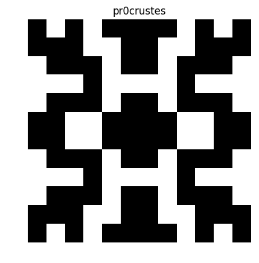

# Pyskal

Pyskal is a command line python3 script that receives a text input and converts it into a image.

Pyskal dependencies are:
     numpy
     matplotlib
     scipy
    
# Examples
The following images were generated using the title as seed.
 

 
 

 
 

 
 

 
 

 
